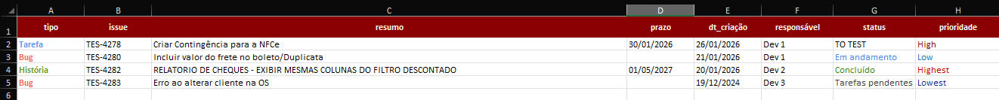

# Jira XML to XLSX

CLI em Python para transformar exportações XML do Jira em uma planilha Excel organizada, com opção de gerar também um arquivo `.txt`.

## O que ele faz

- Lê um arquivo `.xml` exportado do Jira
- Extrai os campos informados pelo usuário
- Gera uma planilha `.xlsx` com formatação visual
- Aceita uma pasta com vários XMLs, criando uma aba para cada arquivo
- Permite exportar um `.txt` com os mesmos dados, se você quiser

## Requisitos

- Python 3.9+
- Biblioteca `openpyxl`

Instalação:

```bash
pip install openpyxl
```

## Uso rápido

```bash
python criar_csv_issues.py <xml_path> <propriedades>
```

Exemplo:

```bash
python criar_csv_issues.py exports/jira.xml type/key/summary/status/priority
```

## Argumentos

| Argumento | Tipo | Descrição |
| --- | --- | --- |
| `xml_path` | Posicional | Caminho do arquivo XML ou de uma pasta com XMLs |
| `propriedades` | Posicional opcional | Lista de propriedades separadas por `/` |
| `-d`, `--default` | Flag | Usa o conjunto padrão de propriedades |

## Modo default

Se você preferir não informar a lista de campos manualmente, use `-d`:

```bash
python criar_csv_issues.py exports/jira.xml -d
```

Campos padrão:

- `type`
- `key`
- `summary`
- `due`
- `created`
- `assignee`
- `status`
- `priority`

## Exemplos

### Um único XML

```bash
python criar_csv_issues.py exports/jira.xml type/key/summary/assignee/status
```

### Usando o conjunto padrão

```bash
python criar_csv_issues.py exports/jira.xml -d
```

### Processando uma pasta com XMLs

```bash
python criar_csv_issues.py exports/ -d
```

Nesse modo, cada arquivo `.xml` encontrado vira uma aba separada na planilha.

## Saída gerada

O script gera:

- `XLSX` como saída principal


- `TXT` opcional, se você responder `s` no prompt final


Ao final da execução, o programa pergunta:

```text
Deseja gerar um arquivo TXT, além da planilha? (s/n):
```

## Formatação da planilha

A planilha criada pelo script já vem com alguns detalhes visuais para facilitar a leitura:

- Cabeçalho com cor de destaque
- Colunas ajustadas automaticamente
- Quebra de linha em campos longos
- Formatação de data em `created`, `updated` e `due`
- Destaque por cor em `type`, `priority` e `status`

## Mapeamento de campos

Alguns campos recebem um nome amigável no cabeçalho da planilha:

| Campo original | Cabeçalho na planilha |
| --- | --- |
| `key` | `issue` |
| `type` | `tipo` |
| `summary` | `resumo` |
| `description` | `descrição` |
| `created` | `dt_criação` |
| `updated` | `última atualização` |
| `reporter` | `relator` |
| `assignee` | `responsável` |
| `priority` | `prioridade` |
| `due` | `prazo` |

## Observações

- O script tenta buscar os valores tanto em tags diretas quanto em `customfield`.
- Se uma propriedade não for encontrada, a coluna ainda é mantida na saída final.
- Datas no formato do Jira são convertidas para `DD/MM/AAAA` quando possível.
- Se a pasta informada não contiver arquivos `.xml`, o processo é interrompido com aviso.
